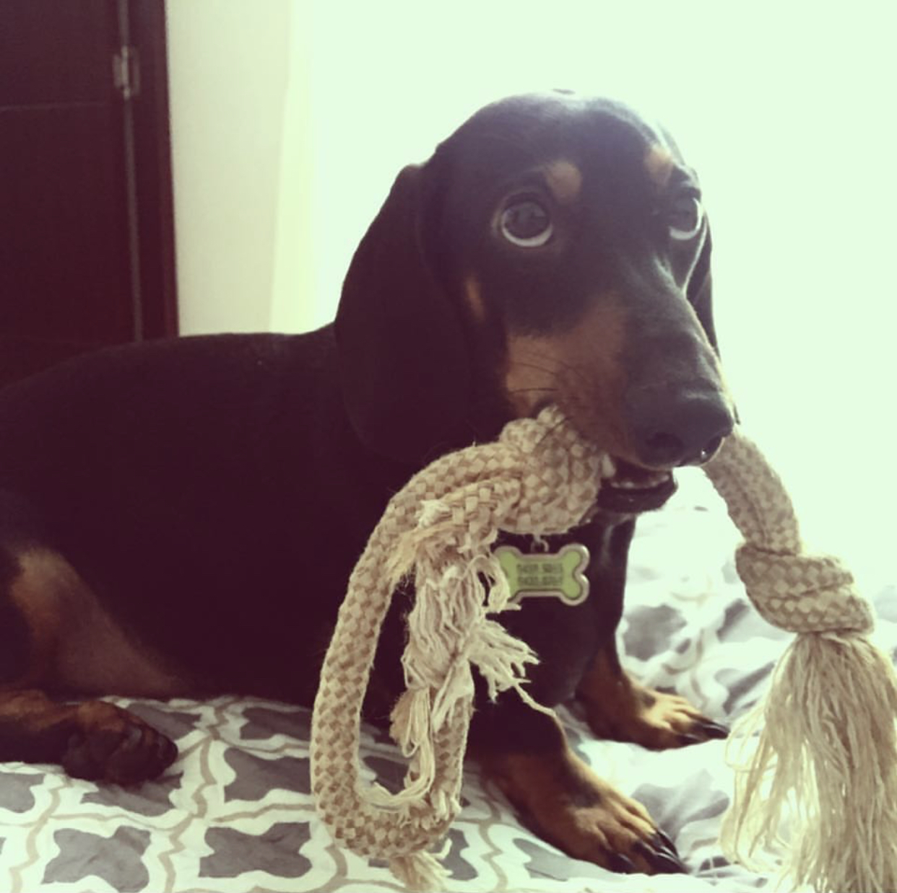
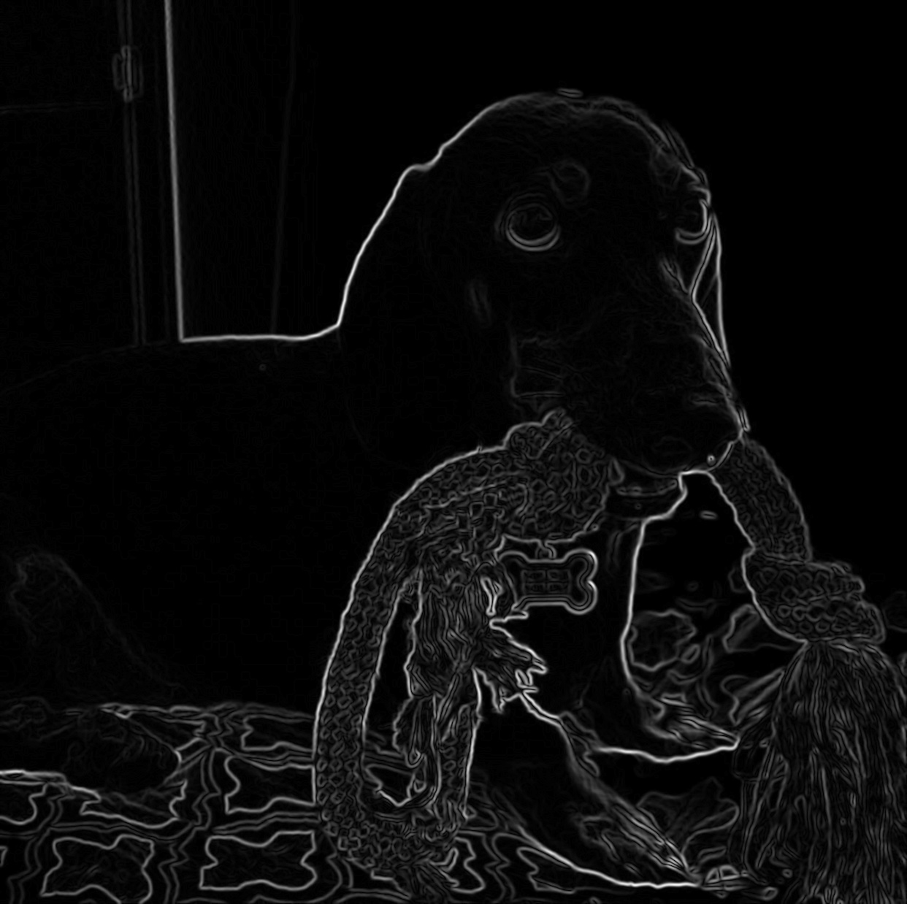

# Getting Started with CUDA Accelerated OpenCV

> This repository contains the code presented in the GTC2021 S31701
  talk.

## Description

This project presents a series of programs that guide you through the
process of optimizing a CUDA accelerated OpenCV algorithm. This
optimization is done through a series of well defined steps without
getting into low-level CUDA programming.

The algorithm chosen to illustrate the optimization process is the
calculation of the [magnitude of the Sobel
Derivatives](https://docs.opencv.org/3.4/d2/d2c/tutorial_sobel_derivatives.html). While
not very interesting on its own, this algorithm is a foundational step
in many algorithms such as edge detection, image segmentation, feature
extraction, computer vision and more. While many optimizations can be
achieved by approximating the underlying math, the original definition
is kept for didactic purposes. The purpose is to focus the study on
the appropriate OpenCV+CUDA handling.

  
  

